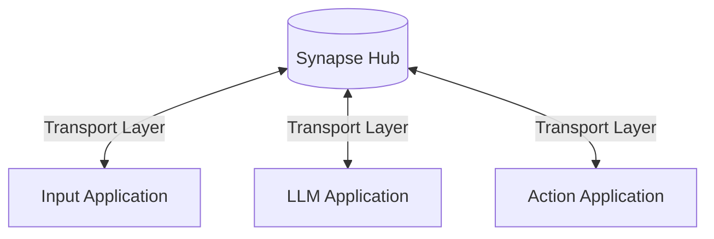
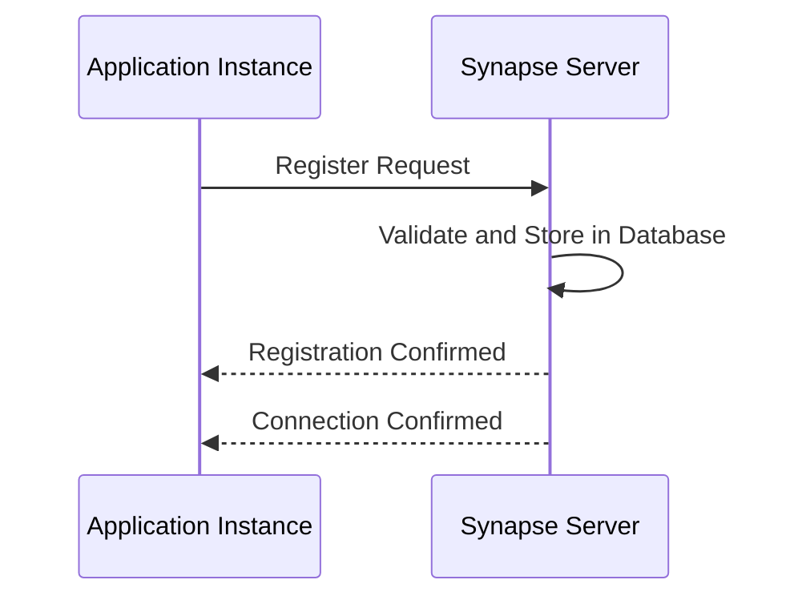
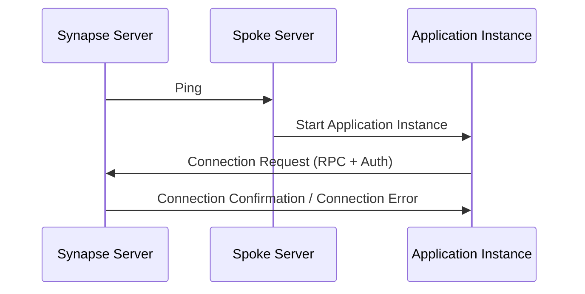
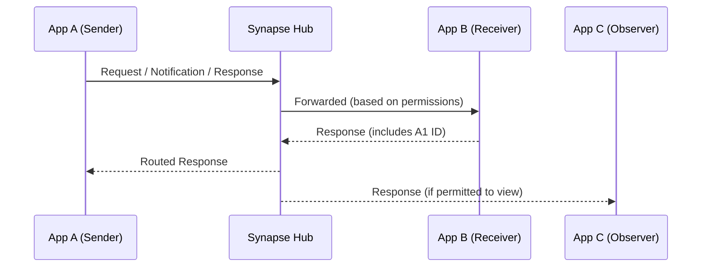
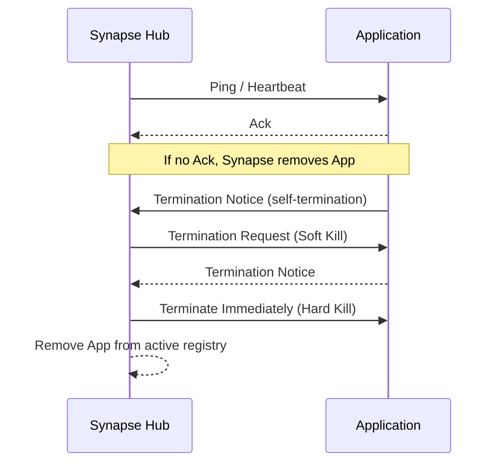

# Core Arcitecture
> Under the hood of SYNAPSE and the NERVE-work

SYNAPSE (Structured Yielding Network Anchor for Propagation and Spoke Execution) is built on a modular hub-spoke network system which uses
**Graph-Based Access Control (GBAC)**, which models permissions as directed
edges between application nodes, enabling fine-grained control over who can
send, receive, or view specific messages.

## Overview

The NERVE-work is a simple hub-spoke network with SYNAPSE as the central hub
and the applications acting as spokes that send request and responses for other
applications on the network to use.



### What Does This Mean?

With this network architecture Components, new applications can be built to work as a 
mediator between existing servers and services and the NERVE-work.
For example, an application can be made or a music streaming service allowing
other applications like the LLM and the user to control the users instance of
the music service.

## Components

### Transport Layer

Communication between synapse can be theoretically done via any transport
mechanism like HTTP, STDIO, TCP e.t.c. However communication between
applications is currently done over TCP and work arounds of other mechanisms
will require alterations of the synapse.

All data exchange is done using [JSON-RPC](https://www.jsonrpc.org/) 2.0. the
JSON-RPC specification for information about the data exchange format.
See the [JSON-RPC specification](https://www.jsonrpc.org/specification) for 
more details.

### Messages

JSON-RPC has 3 kinds of message formats.

1. **Request**: Expect action to be performed and a response.

```typescript
interface Request {
    jsonrpc: "2.0";
    id: string | undefined;
    method: string;
    params?: { [key: string]: any };
}
```

2. **Response**: Messages that either give context or in response to a request.

```typescript

interface Response {
    jsonrpc: string = "2.0";
    id: string | Undefined;
    result: { string: any };
    error: Error;
}
```

- **Error Response**: Give context on errors from an application.

```typescript
interface Error {
    code: integer;
    message: string;
    data?: [ ... ] | { sting: any };
}
```

3. **Notification**: Only to perform an action, no response should be returned.

```typescript
interface Notification {
    jsonrpc: string = "2.0";
    method: string;
    params?: { string: any }
}
```

## Connection Cycle

### **Registration**

This sequence illustrates how an application **registers itself** with Synapse:

* The **Application Instance** initiates the process by sending a
**Register Request** to Synapse.
* The request includes:

  * **Authentication data**
  * **Permission scope**
  * **Application description and metadata**
* **Synapse** processes the registration:

  * It validates the request
  * Stores the application info in its internal database
* Once successful, Synapse responds with:

  * A **Registration Confirmation**
  * A **Connection Confirmation** to finalize the link



### **Initialization**

This sequence outlines how an application instance connects to Synapse:

* **Synapse** begins the process by sending a `Ping` to a known **Spoke Server**.
* The **Spoke Server** responds by starting a new **Application Instance**.
* Once initialized, the **Application** sends a **Connection Request** to
Synapse. This includes RPC metadata and authentication data.
* **Synapse** processes the request and replies with either a
**Connection Confirmation** or an appropriate **Connection Error**.



### Data Exchange

In Synapse, any connected application can initiate communication by sending a
**Request**, **Response**, or **Notification**. Synapse uses its permission
graph to determine where data can propagate and ensures secure routing based
on visibility and access controls.

- Applications send messages to Synapse.
- Synapse forwards those messages only to applications that have permission to
access them.
route the response properly.
- Synapse redistributes valid responses to:
  - The originating application
  - Other apps with response visibility permission



### Termination

Synapse manages lifecycle and connection integrity by actively monitoring the status of connected applications:

- **Health Checks**: Synapse periodically sends heartbeat or status notifications to each connected app. If an app fails to respond or disconnects, Synapse automatically removes it from the active registry.
- **Self-Termination**: Applications can send a `Termination Notice` to gracefully disconnect from Synapse.
- **Synapse-Initiated Termination**:
  - **Soft Kill**: Synapse sends a termination request; the application is expected to acknowledge and terminate cleanly.
  - **Hard Kill**: Synapse sends an immediate termination message and removes the app from its connection registry without waiting for a response.


