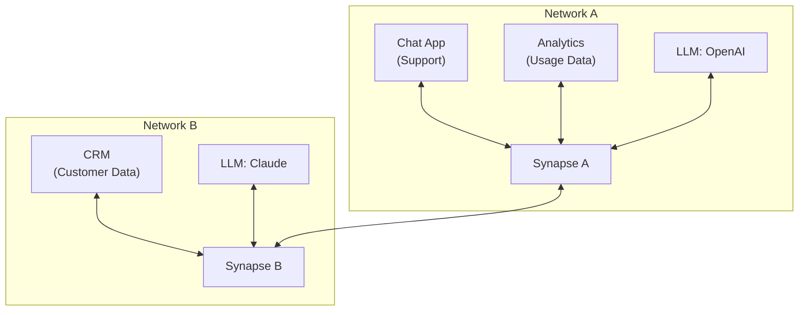

# Introduction

> Getting started with SYNAPSE, building a NERVE-work

Synapse 
Structured Yielding Network Anchor for Propagation and Spoke Execution) is a
relay hub that connects spokes, providing shared context across applications
such as LLMs—and enabling coordinated action execution.

Think of SYNAPSE as a network switch for all kinds of applications.
Just as network switches provide a standard way to connect devices,
SYNAPSE provides a standardized way to connect applications
(AI models, tools and controllers) to other applications, creating an
intelligent network of applications.

# Why SYNAPSE

SYNAPSE enables you to build complex workflows powered by LLMs or any other
control applications of your choice. Since LLMs often need to interact with
external data and tools, SYNAPSE provides the necessary integration layer to
support that seamlessly, synapse provides:

- 🔄 **LLM-Agnostic**: Easily switch between any large language model or vendor
with ease.
- ⚡ **Build on the NERVE-work**: Quickly create applications and agents in any
language.
- 🔐 **Security First**: Scoped permissions, secure channels,
    and infrastructure-aware design to keep your data safe.
- 🌍 **Scalable & Lightweight**: Deploy anywhere from a single container to a
global network of services. One node, infinite reach.
- 🔌 **Multi-LLM & Multi-Hub Coordination**: Seamlessly connect and orchestrate
multiple LLMs or even other Synapse hubs in a unified workflow.
- 🚀 **Workflow-Ready by Default**: Define, propagate, and execute structured
actions across your agents with minimal configuration.
- 🧰 **Pre-Built Integrations**: A growing library of plug-and-play connectors for
tools, APIs, databases, and services.
- ❤️ **Open Source & Developer-Friendly**: Built in the open for
builders-extend it, self-host it, or contribute to shape its future.

# General Architecture

SYNAPSE is a core part of the NERVE-work which is a simple hub-spoke network
where the hub connets to multiple spokes and other hubs and provides a
peer-to-peer-like experience.

# Explore

<FeaturesGrid>
    <Feature
        title="Architecture"
        details="Understand how Synapse hubs, spokes work together to route
        actions and data securely."
        link="/guide/architecture"
    />
    <Feature
        title="Permissions"
        details="Define fine-grained control over who can trigger what,
        ensuring safe and auditable interactions."
        link="/guide/permissions"
    />
</FeaturesGrid>

# Contributing

Want to help improve SYNAPSE? Check out ou
[Contributing Guide](/development/contributing) to get started.

# Support and Feedback

How to get help, share ideas, or support the Synapse project:

- Found a bug or want to request a feature?
[Open an issue on GitHub](https://github.com/kyprware/synapse) for the
SYNAPSE specification, or documentation.

- Have questions or feedback about the SYNAPSE? Join the
[discussion](https://github.com/kyprware/synapse/discussions).

- Need help with other open source components in the NERVE project ecosystem?
Head over to the
[organization-wide discussions](https://github.com/orgs/kyprware/discussions)
for community support.

- Want to support our mission? Star our
[repository](https://github.com/kyprware/synapse), explore our
[community](https://github.com/kyprware), check out and support our
[contributors](/development/contributors), or
[contribute](https://github.com/kyprware/synapse) to the project. Every bit
helps.
