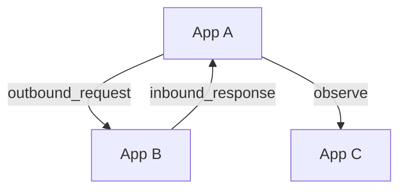

# Permission System

> How Synapse enforces scoped, secure communication across the NERVE-work

Synapse uses a **Graph-Based Access Control (GBAC)** system that defines which
applications can perform specific actions on other applications across the
network.

Each permission forms a directed edge in a permission graph:
**Application A → Application B with Action X** Permissions are enforced at
runtime for every message.

## Core Concepts

- **Applications**: Individual agents or tools connected to Synapse.
- **Actions**: RPC interaction types (e.g., request, notification).
- **Permissions**: Explicit grants allowing one app to act on another.
- **Roles (Groups)**: Named collections of applications that share permissions.
- **Audit Logging**: Every denied or allowed action is recorded for traceability.

## RPC Actions

Each permission is scoped to an `RPCAction` — a specific type of interaction:

| RPCAction              | Description |
|-|-|
| `inbound_request`      | Receive requests from another application |
| `inbound_response`     | Receive responses from another application |
| `inbound_notification` | Receive fire-and-forget notification |
| `outbound_request`     | Send requests to another application |
| `outbound_response`    | Send responses to another application |
| `outbound_notification`| Send notifications to another application |

> Only applications with an active permission entry are permitted.

## How Permissions Work

- Every permission includes:
  - **Owner**: the acting (initiating) application
  - **Target**: the receiving (affected) application
  - **Action**: the RPCAction being permitted
- Permissions are stored in a normalized table and enforced during message
routing.
- **Cyclical permission chains are disallowed** to prevent infinite loops and
misrouting.



> Multiple applications may have permissions on the same target, but circular
dependencies are automatically blocked by Synapse.

## Privileged Applications

Applications that are granted **privileged actions** may:

- Create or revoke permissions at runtime
- View the permission graph
- Manage roles or groups of applications
- Register or deactivate other applications

These capabilities are **guarded by runtime checks** and logged securely.

## Runtime Behavior

Synapse enforces permissions dynamically:

- On every RPC call, Synapse checks if the caller has an active permission for
the action and target.
- If not, the message is dropped or denied.
- All permission denials are recorded in the **audit log**.
- Responses include permission context to help apps self-correct or escalate.

## Application Roles

> Roles are groupings of applications by name and ID, which will allow batched
permissions in the future.

A role may contain:
- A unique ID
- A name (e.g., `llm-agents`, `tooling-layer`)
- A list of assigned application IDs

Group-level permissions are not yet enforced but will allow actions like:

```plaintext
App A → Role: llm-agents → outbound_request
```

## Data Model Summary

Each `ApplicationPermission` entry includes:

```json
{
    "owner_id": "uuid-of-sender-app",
    "target_id": "uuid-of-receiver-app",
    "action": "outbound_request",
    "is_active": true
}
```

All actions are validated against the `RPCAction` enum.

## Permission Graph at Runtime

Synapse maintains a permission graph in memory for efficient lookups, ensuring:

- Only valid edges are used
- Cycles are rejected during insertion
- Audit logs are updated for each interaction

## Security Model

- Application tokens are **AES-encrypted** and **base64-encoded** before
storage.
- Only active, registered applications are allowed to initiate communication.
- Synapse's permission engine is strict, with no implicit trust.

## Managing Permissions

| Action                    | Who can perform it |
|-|-|
| Register application      | Public or admin application |
| Grant permission          | Privileged applications only |
| Revoke permission         | Privileged applications only |
| Terminate application     | Self or Synapse (via soft/hard kill) |
| View audit logs           | Privileged applications |

